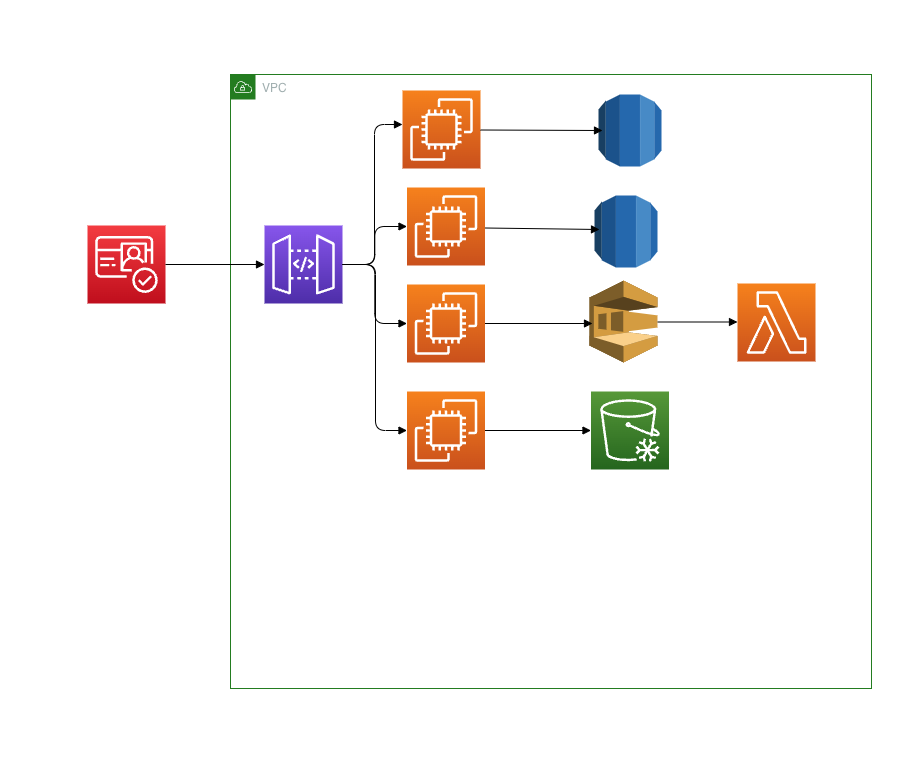

# Lab 11

## Part 1: Designing Cloud Infrastructure

- Task:
  - Design a cloud infrastructure for a scalable web application.
  - Include components like compute instances, storage, and network configurations.
  - Use AWS EC2, S3, and VPC to build the basic architecture.

## Part 2: IAM Configuration

- Task:
  - Define IAM roles and policies for different components of the architecture, such as developers, admins, and application servers.
  - Ensure that each role adheres to the principle of least privilege.

Se necesitan crear los accesos necesarios para el acceso a cada recursos con las siguientes caracteristicas

- Permisos a las base de datos de escritura y lectura por solo los EC2 que lo necesiten
- Permisos para poder ejecutar lambda al SQS
- Permisos de lectura y escritura para el S3
- Api gateway permisos de llamadaos a los EC2
- Cognito el acceso unico al api gateway

## Part 3: Resource Management Strategy

- Task:

  - Develop a strategy for managing resources that includes auto-scaling, load balancing, and cost optimization using AWS Auto Scaling, ELB, and AWS Budgets.

- Configuracion de Auto Scaling para poder escalar automaticamente en los EC2 necesarios para soportar la carga
- Configurar Elastic Load Balancing para balanciar la carga entre los diferentes pods que se encuentren en las EC2
- Configurar AWS Budgets para establecer los limites de uso de la arquitectura y configurar alertas cuando los costos se encuentren en el umbral de riesgo.

## Part 4: Theoretical Implementation

Using the AWS services identified, outline the architecture for the web application. Describe how each component interacts with others, focusing on the flow of data and control between services. This description should detail the role of each service in the architecture, ensuring a clear understanding of their interactions and dependencies.

Se utiliza cognito para autentificar y autorizar el uso del sistema, se cuenta con cuatro microservicios los cuales se centran en el manejo de productos, clientes, guardado de imagenes,bocetos y/o archivos, y un microservicios que realizar la venta por medio de una lambda la cual nos ayudara a tener registro de cuales si fueron procesadas y cuales no han sido procesadas, cada microservicio estara expuesto por medio de api gateway el cual solo puede ser consumido por cognito.

## Part 5: Discussion and Evaluation

- Discussion Points:
  - Explain the choice of services and how they interact to provide a resilient and secure infrastructure.
  - Discuss how the designed IAM policies contribute to overall security.
  - Review the resource management strategy to ensure it meets the scalability and cost-efficiency needs.

Se ocupo la arquitectura de microservicio para que se pueda seguir operando si alguno otro microservicio presenta problemas, el manejo de sqs es para tener una pila donde podamos ir procesando de forma lineal las ordenes, para comprobar siempre que haya existencia de los prodcutos, y para garantizas el uso de recursos se utilza el Auto Scaling para que nada mas se pague por lo que se utilice y no se genere un costo extra
